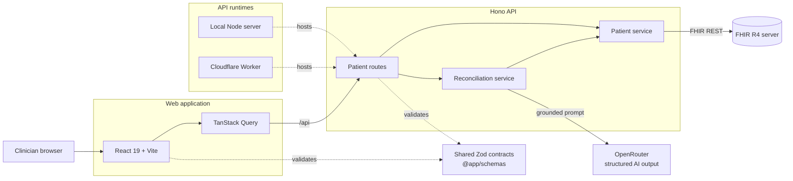

<div align="center">
  

# RecMeds

**AI-assisted medication reconciliation, grounded in clinical source records.**

Search synthetic FHIR patients, compare their current medication report with
prior records, and produce an evidence-linked brief for clinician review.

[Live demo](https://recmeds.cbas.workers.dev) | [Web app](apps/web) | [API](apps/api)
</div>

## What It Does

RecMeds brings fragmented medication information into one review workflow:

1. Search for a synthetic patient by name, date of birth, or MRN.
2. Load normalized medication and clinical records from a FHIR R4 server.
3. Enter what the patient reports taking today, including OTC products and
   recent changes.
4. Compare the report with source records using structured AI analysis.
5. Review discrepancies, safety flags, recommended verification steps, and the
   evidence behind each finding.

The landing page also previews planned standalone SMART on FHIR connections for
Epic, Oracle Health, MEDITECH, and athenahealth. These integrations are not yet
active; **Demo EHR** is the currently supported workflow.

## Architecture



The frontend and API share Zod schemas so requests, responses, and AI output use
the same runtime-validated contracts. Reconciliation results are checked against
the available record IDs before they are returned to the browser.

## Tech Stack

| Area             | Technology                                          |
| ---------------- | --------------------------------------------------- |
| Frontend         | React 19, Vite, TypeScript, Tailwind CSS, shadcn/ui |
| Client data      | TanStack Query                                      |
| API              | Hono                                                |
| Clinical data    | FHIR R4                                             |
| AI               | Vercel AI SDK, OpenRouter, structured Zod output    |
| Shared contracts | Zod workspace package                               |
| Tooling          | Bun workspaces, ESLint, Prettier                    |
| Deployment       | Cloudflare Workers                                  |

## Quick Start

### Prerequisites

- [Bun](https://bun.sh/) installed
- An [OpenRouter](https://openrouter.ai/) API key to run reconciliation

### Install and configure

```bash
bun install
cp apps/api/.env.example apps/api/.env
```

Add your OpenRouter key to `apps/api/.env`:

```dotenv
OPENROUTER_API_KEY=your_key_here
```

The remaining defaults use the public HAPI FHIR R4 test server and are suitable
only for synthetic demo data.

### Run locally

```bash
bun run dev
```

| Service      | URL                                |
| ------------ | ---------------------------------- |
| Web app      | `http://localhost:5173`            |
| API          | `http://localhost:3001/api`        |
| Health check | `http://localhost:3001/api/health` |

Vite proxies browser requests under `/api` to the local API. To run either app
independently:

```bash
bun run dev:web
bun run dev:api
```

## Configuration

API configuration is read from `apps/api/.env` during local development.

| Variable                     | Required           | Default                        | Purpose                                 |
| ---------------------------- | ------------------ | ------------------------------ | --------------------------------------- |
| `OPENROUTER_API_KEY`         | For reconciliation | None                           | Authenticates AI requests               |
| `FHIR_BASE_URL`              | No                 | `https://hapi.fhir.org/baseR4` | FHIR R4 endpoint                        |
| `FHIR_MRN_SYSTEM`            | No                 | None                           | Restricts MRN identifiers to one system |
| `WEB_ALLOWED_ORIGINS`        | No                 | `http://localhost:5173`        | Comma-separated CORS origins            |
| `FHIR_REQUEST_TIMEOUT_MS`    | No                 | `15000`                        | FHIR request timeout                    |
| `FHIR_MAX_PAGES`             | No                 | `10`                           | Maximum FHIR bundle pages               |
| `FHIR_MAX_RESOURCES`         | No                 | `500`                          | Maximum resources loaded per request    |
| `RECONCILIATION_MAX_RECORDS` | No                 | `100`                          | Maximum records sent for analysis       |
| `AI_REQUEST_TIMEOUT_MS`      | No                 | `25000`                        | AI request timeout                      |
| `AI_MAX_OUTPUT_TOKENS`       | No                 | `2500`                         | Maximum structured response size        |

Set `VITE_API_BASE_URL` for the web app only when the API is hosted separately.
The value must include the `/api` path.

## API

All routes are mounted under `/api`.

| Method | Route                                  | Description                                |
| ------ | -------------------------------------- | ------------------------------------------ |
| `GET`  | `/health`                              | Service health check                       |
| `GET`  | `/patients`                            | Search by `name`, `dateOfBirth`, or `mrn`  |
| `GET`  | `/patients/:patientId/context`         | Load normalized patient and source records |
| `POST` | `/patients/:patientId/reconciliations` | Generate a clinician-review reconciliation |

Example reconciliation request:

```json
{
  "currentMedicationNotes": "Metformin 500 mg twice daily with meals"
}
```

## Repository Layout

```text
.
|-- apps
|   |-- api          # Hono API, FHIR client, and AI reconciliation
|   `-- web          # React medication-reconciliation interface
|-- packages
|   `-- schemas      # Shared Zod API and domain contracts
|-- AGENTS.md        # Repository guidance for coding agents
|-- bun.lock
`-- package.json     # Workspace scripts and dependencies
```

The API application is defined once in `apps/api/src/app.ts`, served through a
local Node entrypoint during development, and deployed as a Cloudflare Worker.
Cloudflare Workers is the only production API target; the project does not
include an AWS Lambda adapter or packaging workflow.

## Verification

Run the repository checks from the root:

```bash
bun --cwd apps/web lint
bun --cwd apps/web build

bun --cwd apps/api lint
bun --cwd apps/api typecheck
bun --cwd apps/api build

bun --cwd packages/schemas typecheck
```

There is currently no automated test suite.

## Deployment

The web app and public API are configured as separate Cloudflare Workers. Before
deploying, set the production API URL for the frontend, configure the allowed web
origin in `apps/api/wrangler.jsonc`, and upload the OpenRouter secret:

```bash
bunx wrangler secret put OPENROUTER_API_KEY --config apps/api/wrangler.jsonc
bun run deploy:api
bun run deploy:web
```

See the app-specific documentation for more detail:

- [`apps/web/README.md`](apps/web/README.md)
- [`apps/api/README.md`](apps/api/README.md)
